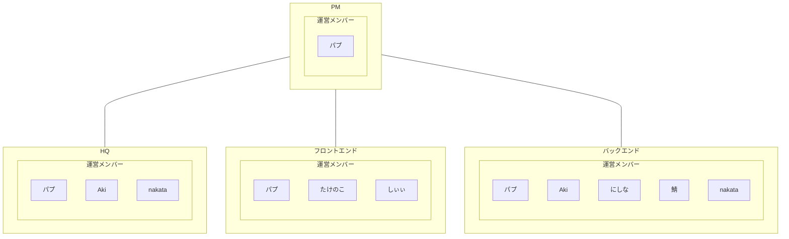

# NW勉強会
当資料はNW勉強会の基本情報をまとめた資料。  
## 目次
- [プロジェクト概要](#プロジェクト概要)
- [目的](#目的)
- [目標](#目標)
- [利用ツール](#利用ツール)
- [ドキュメント管理](#利用ツール)
- [会議体](#会議体)
- [組織体](#組織体)
## プロジェクト概要

## 目的

## 目標

## 利用ツール
  - GitHub  
    プロジェクトで作成された成果物の管理に利用する。ただし、パワーポイントやPDFファイルなどのGitHubで管理するには適さないドキュメントについては、別途ドキュメント管理ツールを利用する。
  - Discord  
    プロジェクト参加メンバーのコミュニケーションツールとして利用する。
  - Gitprojects
    プロジェクト進捗管理ツールとして利用する。
## ドキュメント管理
  - 管理方針  
    GitHubで管理する成果物の記載方法はMarkdown記法を基本とする。  
    ただし、作成過程で別の記法が適している場合はこの限りではない。  
    各成果物の保管場所については、各項目で示す。
  - 命名規則  
    命名規則については、下記方針を基本とする。  

    - 議事録  
      `yyyymmdd_minutes`
    - その他  
      `yyyymmdd_【種別】_【タイトル】`  
      例：`yyyymmdd_common_kick-off`
    - 種別
      - common
      - hq
      - front
      - back
  - 参考資料  
    - [Markdown記法と書き方](https://help.docbase.io/posts/13697)  
    - [Mermaid (マーメイド) 記法と書き方](https://help.docbase.io/posts/3719897)
## 会議体
### 実施スケジュール
  週1回：日曜日 21:00〜  
### 参加者
  会議参加者を下記に示す。  
  参加者の区分については組織体に示す。
  - 運営メンバー  
  - プロジェクトメンバー
### 会議のファシリテーターについて
  ファシリテーターは基本、PM及びHQチームにて行う。  
  各チームメンバーについては、組織体に示す。
### 議題内容
  - 要件定義フェーズまでは企画会議
  - 実作業開始後は進捗報告予定
    - 報告形式については後日相談
  - 定例会時はアジェンダ資料を用意して視覚化する
### 議事録
  - 管理方針  
    議事録は下記ディレクトリにて管理する。  
    ファイルの命名規則ついては命名形式に従う。  
    議事録については、会議後3日以内でGitHubにアップロードすること。
    ```
    │
    └── docs
        └── minutes
            ├── template.md
            └── yyyymmdd_minutes.md
    ```
  - 記載方針  
    議事録の、template.mdを活用すること  
    また、テンプレートにない項目でも、必要に応じ追加すること  
  - 書記  
    書記については、運用メンバーの持ち回りとする。  
    書記当番で欠席する場合は事前に全体向けに連絡し、交代の調整を行うこと。  
    ただし、急用により直前欠席となり調整できない場合は、会議内で当番を改めて決定する。  
    次回書記当番については会議の終盤に決定する。
## 組織体
  本プロジェクトについては、プロジェクト方針、タスク管理、実行、運営を実施する運営メンバーと各チームでプロジェクトの見学、協力を実施するプロジェクトメンバーに分かれる。
### 運営メンバー  
※敬称は省略いたします。  
  - パプ
  - Aki
  - nakata
  - たけのこ
  - しぃぃ
  - にしな
  - 鯖  
### プロジェクトメンバー

### チーム
本プロジェクトを進行するにあたり必要なチームについて記載する。  
また、プロジェクトの過程でチームの追加が必要になった場合は、組織図の更新を行う。  
  - PM
    プロジェクトの目標達成に必要な計画、各チームへの指揮、調整、予算管理、ステークホルダーとの折衝を行う。  
    - 成果物保管場所  
      GitHubでの成果物保管場所については、下記ディレクトリを使用する。  
      ディレクトリの修正があった場合、随時更新を行うこと。  
      ```
      │
      └── project-manager
      ```
  - HQ  
    PMのサポート及び全体スケジュールの調整、課題管理、全体定例のファシリテーターを行う。  
    - 成果物保管場所  
      GitHubでの成果物保管場所については、下記ディレクトリを使用する。  
      ディレクトリの修正があった場合、随時更新を行うこと。  
      ```
      │
      └── headquarters
      ```
  - フロントエンド  
    機能要件に則ったアプリケーションの開発を行う。  
    - 成果物保管場所  
      GitHubでの成果物保管場所については、下記ディレクトリを使用する。  
      ディレクトリの修正があった場合、随時更新を行うこと。  
      ```
      │
      └── front-end
      ```
  - バックエンド  
    非機能要件に則った基盤の開発を行う。  
    - 成果物保管場所  
      GitHubでの成果物保管場所については、下記ディレクトリを使用する。  
      ディレクトリの修正があった場合、随時更新を行うこと。  
      ```
      │
      └── back-end
      ```
### 組織図
