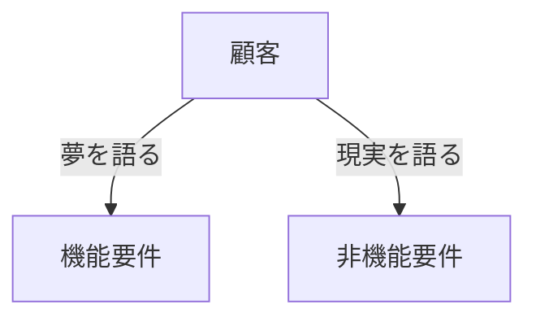

# インフラの要件定義について
 作成者：nakata
## 目次
 - [はじめに](#はじめに)
 - [参考資料](#参考資料)
 - [要件定義ってなに？](#要件定義ってなに)
 - [機能要件と非機能要件](#機能要件と非機能要件)

## はじめに
 本書では、インフラが主に担当する非機能要件について記載する。  
 あくまで、作成者の考え方を記載しているため、これが要件定義の基本的な考え方とは限らないので注意してください。

## 参考資料
 - [システム構築の上流工程強化（非機能要求グレード）紹介ページ](https://www.ipa.go.jp/archive/digital/iot-en-ci/jyouryuu/hikinou/ent03-b.html)  
 - [非機能要求グレード本体（日本語版）、利用ガイド［活用編］一括ダウンロード](https://www.ipa.go.jp/archive/digital/iot-en-ci/jyouryuu/hikinou/ps6vr700000077he-att/000028843.zip)  

## 要件定義ってなに？
 要件定義は顧客の要求を具現化し、システム実装に向けて具体的な機能や性能、制約条件を明文化するフェーズ。  
 もう少し、嚙み砕いて言うと、顧客の頭の中にあるイメージを設計書に落とし込めるようにヒアリングしようってことです。  

## 機能要件と非機能要件
 要件定義では、機能要件と非機能要件の2つの要件（カテゴリ）に分けて進めていく。  
 - ### 機能要件  
    機能要件は顧客のやりたいこと、実現したいシステムを明文化する。  
    比較的イメージのしやすい要件であるため、私は顧客の夢を叶える要件と捉えて入る。  
    ※イメージしやすいとは言ったが、顧客とエンジニアで認識齟齬も起きやすいので、決して簡単ではない。  
 - ### 非機能要件  
    非機能要件は顧客のして欲しくない、起きて欲しくことを明文化する。
    機能要件とは違い、顧客がイメージしづらい要件のため、提案ベースになることが多い。  
    私は非機能要件を顧客の現実を達成する要件と捉えている。  
    基本的にインフラエンジニアは、この非機能要件を担当する。

## 非機能要求グレード
 非機能要求グレードはIPAが公開している非機能要件を進めるための、補助ツールである。一つ一つの項目で細かく定義していくので、学習やノウハウのない初回の要件定義で用いることが多い。    
 ただし、この非機能要求グレードをベースに進めると、とんでもなく細かい要件定義になってしまい、工数やシステムに見合わないものになってしまうので、困ったときの参考程度に使用するのがお勧め。  
 ※今回は学習目的のため、この非機能要求グレードをベースに進めていきます。
## まとめ
 インフラエンジニアが主に担当する非機能要件は、イメージのしづらい分野ではあるが、現実的な話をし、事ある毎に顧客へ確認が入るため、機能要件ほど認識齟齬が起きづらいと私は思います。  
 ただし、ノウハウや参考資料は機能要件ほど公開されていないので、少しづつ経験を積んで覚えていくしかないと思います。